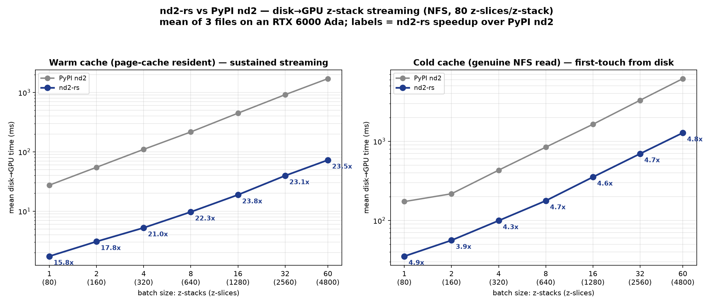
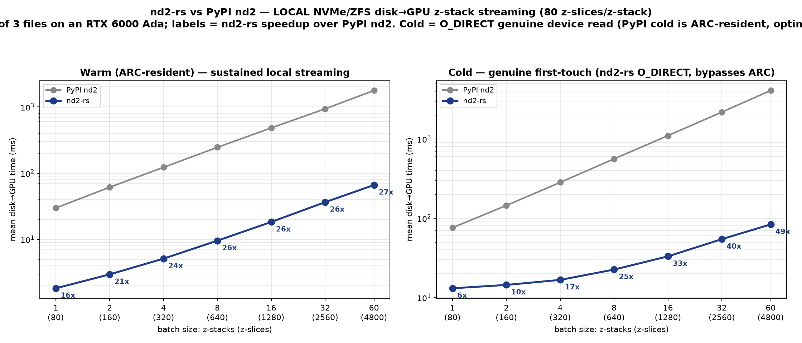

# rsnd2

A fast ND2 (Nikon NIS-Elements) file reader with a Rust core and Python bindings.

`rsnd2` parses ND2 files in Rust and exposes them through a Python API that is
compatible with the popular [`nd2`](https://pypi.org/project/nd2/) package, so
existing code can switch readers with minimal changes. The package is imported
as `rsnd2`

## Project layout

| Path | Description |
| --- | --- |
| `src/` | Rust core. `src/lib.rs` exposes the parser, index, and FFI helpers; `src/main.rs` provides the CLI. |
| `src-python/rsnd2/` | Python package. `_ffi.py` loads the native library, `_nd2file.py` provides `ND2File`, `structures.py` holds API-compatible data classes. |
| `tests/` | Python (`unittest`) and Rust tests. |
| `Cargo.toml`, `pyproject.toml`, `setup.py` | Packaging metadata. |

## Python usage

```python
import rsnd2

with rsnd2.ND2File("path/to/file.nd2") as f:
    print(f.shape, f.dtype)
    arr = f.asarray()        # requires the [array] extra

# Or read straight into an array
arr = rsnd2.imread("path/to/file.nd2")
```

## Comparison with the PyPI `nd2` package

`rsnd2` is benchmarked against the upstream [`nd2`](https://pypi.org/project/nd2/)
package on the **disk→GPU batch-streaming** path: the end-to-end wall time to
stream a batch of z-stacks from an `.nd2` file into one contiguous `torch.cuda`
tensor of shape `(batch × z_per_frame, C, Y, X)`.

### What is measured

- A **z-slice** is one plane returned by `read_frame(i)` (what PyPI `nd2` calls a
  "frame"). A **z-stack** is `z_per_frame` contiguous z-slices (default 80), so a
  batch of *B* z-stacks reads *B × 80* contiguous z-slices.
- **Warm:** the file is resident in cache — the steady-state regime for an ML
  data loader on a large-RAM host.
- **Cold:** a genuine *first-touch* read, with the file open + metadata parse
  **inside** the timed section. `rsnd2` reads the pixels with `O_DIRECT`, which
  bypasses both the OS page cache **and** the ZFS ARC and goes straight to the
  device. (Dropping the page cache with `posix_fadvise(DONTNEED)` is enough on a
  plain filesystem, but **not** on ZFS — the ARC can only be evicted as root, so
  a buffered "cold" read there is really served from RAM.)
- Time is end-to-end and includes the host→device (PCIe) transfer and the layout
  transform, not just the disk read.

### Assumptions

- **Fair end-to-end path.** `rsnd2` uses `read_batch_to_torch` (one packed Rust
  read of the whole batch, then a single pinned host→device copy, with the copy
  pipelined behind the read); PyPI `nd2` uses `np.stack([read_frame(i) …])`
  followed by one host→device copy. Both produce a byte-identical CUDA tensor.
- **File format = the fast path:** modern chunked ND2, uncompressed, with packed
  (unpadded) rows. Compressed or legacy-JPEG2000 files take a slower fallback and
  are not represented by these numbers.
- **One client, one GPU** (RTX 6000 Ada), GPU otherwise idle; both readers run in
  separate subprocesses (both distributions import as `nd2`).
- **Test data:** 3× real ND2 files, 4800 z-slices each (60 z-stacks of 80),
  `80×2×212×322` uint16 per z-stack (~21.8 MB). Reported values are the **mean
  across the 3 files**.
- Cold throughput is **storage-bandwidth-bound**, so the speedup over PyPI `nd2`
  depends on the medium (see the two cases below). Warm throughput is bound by
  host memory / PCIe and by PyPI's per-frame Python overhead.

The benchmark harness and full write-up live in the sibling `rsnd2-testing/`
workspace (`gpu_stream_bench.py`, `results/RESULTS.md`).

### Networked storage (NFS, single 10 GbE link)

Test host on a single 10 GbE NFS4 mount (no `nconnect`, `rsize=1 MB`).

| cache | batch (z-stacks) | z-slices | PyPI `nd2` (ms) | `rsnd2` (ms) | speedup | `rsnd2` GB/s |
| --- | --- | --- | --- | --- | --- | --- |
| warm | 1 | 80 | 27.4 | 1.74 | 15.8× | 12.6 |
| warm | 8 | 640 | 216.1 | 9.71 | 22.3× | 18.0 |
| warm | 16 | 1280 | 447.6 | 18.84 | **23.8×** | 18.6 |
| warm | 32 | 2560 | 916.0 | 39.57 | 23.2× | 17.7 |
| warm | 60 | 4800 | 1707.4 | 72.62 | 23.5× | 18.0 |
| cold | 1 | 80 | 173.1 | 35.31 | 4.9× | 0.62 |
| cold | 8 | 640 | 842.1 | 177.4 | 4.8× | 0.99 |
| cold | 16 | 1280 | 1637.1 | 353.0 | 4.6× | 0.99 |
| cold | 32 | 2560 | 3292.4 | 695.4 | 4.7× | 1.01 |
| cold | 60 | 4800 | 6170.4 | 1277.3 | **4.8×** | 1.03 |

Warm is ~23× faster — largely fixed-overhead amortization: PyPI `nd2` reads each
z-slice individually, while `rsnd2` packs the whole z-stack batch in one Rust
call. Cold reads saturate the single-client NFS link (**~1.0–1.1 GB/s on
10 GbE**), so both readers hit the same network ceiling and the ratio is ~4.6–4.9×.
Here the cold pixels are read with `O_DIRECT` (a genuine over-the-wire read, not
a client-cache hit) and the timed section includes the cold open + metadata
parse; the `rsnd2` open was also made cheaper by parsing file metadata without
materialising the full per-plane table (≈12 ms → ≈3 ms cold open). See
`rsnd2-testing/results/RESULTS.md`.



### Local storage (NVMe, ZFS)

Same files copied to a local NVMe-backed ZFS dataset. Batch sizes extend to 60
z-stacks (the whole file), where throughput is highest.

**Warm — cache-resident steady state** (the regime an ML data loader runs in
once files are hot in the ARC):

| batch (z-stacks) | z-slices | PyPI `nd2` (ms) | `rsnd2` (ms) | `rsnd2` GB/s | speedup |
| --- | --- | --- | --- | --- | --- |
| 1 | 80 | 29.9 | 1.83 | 11.9 | 16.3× |
| 8 | 640 | 246 | 9.55 | 18.3 | 25.6× |
| 16 | 1280 | 479 | 18.3 | 19.1 | 26.3× |
| 32 | 2560 | 932 | 36.4 | 19.2 | 25.6× |
| 60 | 4800 | 1771 | 66.2 | 19.8 | **26.7×** |

Warm `rsnd2` sustains **~20 GB/s** and is **16–27× faster** than PyPI `nd2`
(which reads each z-slice in a separate Python call). At this rate the bottleneck
is the **PCIe host→device copy (~20–25 GB/s)**, not the read.

**Cold — genuine first-touch from NVMe** (`rsnd2` with `O_DIRECT`, mean of 3
files):

| batch (z-stacks) | z-slices | `rsnd2` GB/s (cold) |
| --- | --- | --- |
| 1 | 80 | 1.6 |
| 8 | 640 | 5.5 |
| 16 | 1280 | 7.5 |
| 32 | 2560 | 9.1 |
| 60 | 4800 | **10.7** |

Measuring a genuine cold read on this pool is subtle, and the previous "local"
benchmark got it wrong:

- **ZFS caches in the ARC, which `posix_fadvise(DONTNEED)` cannot evict.** A
  buffered "cold" read is served from RAM, not the device — an earlier run
  reported ARC-resident reads (~18 GB/s, cold ≈ warm) as "cold".
- `rsnd2`'s cold path reads with **`O_DIRECT`**, which bypasses the page cache
  and the ARC and goes to the device (on an ARC miss). Genuine cold device
  throughput is **~1.6 GB/s (batch 1) → ~10.7 GB/s (whole-file batch)**. The
  per-file spread is physical NVMe placement — one file striped across both
  vdevs reads at ~15 GB/s, two on a single vdev at ~8 GB/s — not a software
  limit. PyPI `nd2` has no `O_DIRECT` path, so its cold reads cannot be separated
  from the ARC and are not a genuine first-touch comparison.
- Caveat: `O_DIRECT` only bypasses the ARC on a *miss*, so a genuine number needs
  the file uncached (truly fresh, or a root ARC drop). At large batch the path is
  H2D-PCIe-bound, so the end-to-end rate alone cannot prove a read was cold —
  the harness flags reads returning at RAM speed.



### Correctness

Pixel data is byte-for-byte identical to PyPI `nd2`: blake2b hashes matched for
all batch/file/cache cases in both runs above. The batch layout mirrors
`read_frame` exactly, verified for single-channel, multi-channel, and RGB.

## Command-line interface

Build and run the Rust CLI with `cargo`:

```bash
cargo build                       # debug build of the library and CLI
cargo run -- inspect FILE.nd2     # inspect one or more ND2 files
cargo run -- scan ROOT            # scan directories for ND2 files
cargo run -- bench-read FILE.nd2  # benchmark pixel reads
```

## Building the native library

```bash
cargo build --release --lib   # builds the native lib copied into the Python package
```

## Testing

```bash
cargo test                                      # Rust tests
uv run python -m unittest discover -s tests     # Python API tests
```

Run both before submitting a change.

## Contributing

See [AGENTS.md](AGENTS.md) for coding style, testing, and pull-request
guidelines. Keep binary parsing logic in Rust, run `cargo fmt` before
submitting Rust changes.
