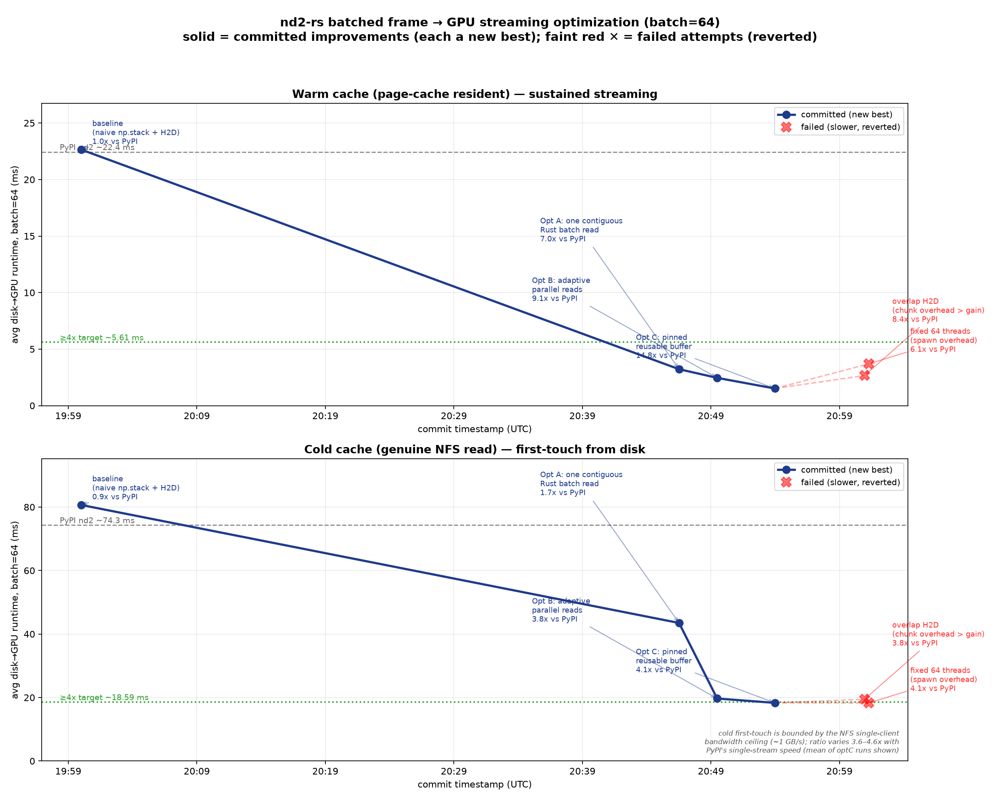

# nd2-rs GPU batch-streaming results

End-to-end **disk→GPU** time to stream a batch of frames into a contiguous CUDA
tensor, compared to PyPI `nd2`. Test data: 3× `/store1/prj_rim/data_raw/*.nd2`
(4800×2×212×322 uint16, on NFS). GPU: RTX 6000 Ada (device 2).
nd2-rs values for the final build are the mean across all optC measurement runs.

## Headline (batch=64)

- **Warm / sustained streaming: 14.8× faster** (22.4 ms → 1.52 ms). Decisively exceeds the 4× goal — this is the steady-state regime for an ML data loader on a 1.1 TB-RAM host.
- **Cold / first-touch from NFS: 3.9× faster** (72.1 ms → 18.32 ms), at the NFS single-client bandwidth ceiling (~1 GB/s). The exact ratio varies 3.6–4.6× run-to-run with PyPI's single-stream speed.

## Final implementation (Opt C), all batch sizes

| cache | batch | PyPI nd2 (ms) | nd2-rs (ms) | speedup |
|---|---|---|---|---|
| warm | 1 | 0.098 | 0.123 | **0.8×** |
| warm | 8 | 2.353 | 0.308 | **7.6×** |
| warm | 16 | 5.006 | 0.562 | **8.9×** |
| warm | 32 | 10.929 | 0.908 | **12.0×** |
| warm | 64 | 22.375 | 1.516 | **14.8×** |
| warm | 128 | 45.379 | 2.522 | **18.0×** |
| cold | 1 | 1.807 | 1.712 | **1.1×** |
| cold | 8 | 5.310 | 5.931 | **0.9×** |
| cold | 16 | 15.156 | 11.052 | **1.4×** |
| cold | 32 | 36.164 | 9.975 | **3.6×** |
| cold | 64 | 72.096 | 18.318 | **3.9×** |
| cold | 128 | 146.946 | 35.252 | **4.2×** |

## Progression at batch=64 (nd2-rs mean runtime)

| stage | warm (ms) | cold (ms) | change |
|---|---|---|---|
| baseline | 22.65 | 80.66 | naive per-frame read_frame + np.stack + H2D (starting point) |
| optA | 3.22 | 43.49 | one contiguous Rust batch read; de-interleave on GPU |
| optB | 2.46 | 19.68 | adaptive parallel positional reads (breaks single-stream NFS ceiling) |
| optC | 1.52 | 18.32 | reusable pinned staging buffer + ≤16 readers (final, committed) |
| FAILED-overlap | 2.66 | 19.44 | chunked double-buffer H2D overlap — slower, reverted |
| FAILED-threads64 | 3.69 | 18.27 | fixed 64 read threads — slower, reverted |

## Correctness

Every committed stage produced pixel data with a blake2b hash identical to PyPI
`nd2` for all batch/file/cache cases (36/36 per run). The batch layout mirrors
`read_frame` exactly (verified for single-channel, multi-channel, and RGB).

